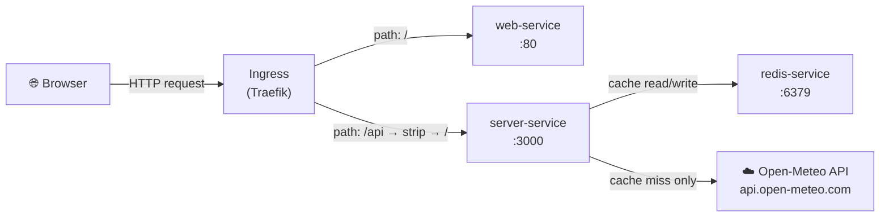
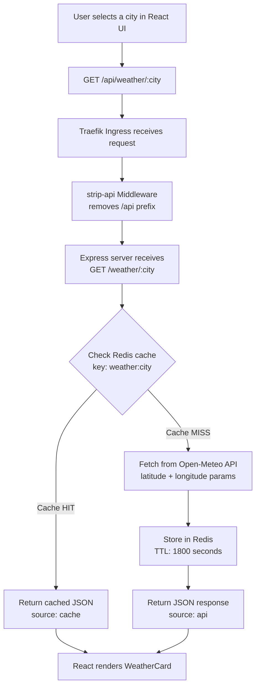
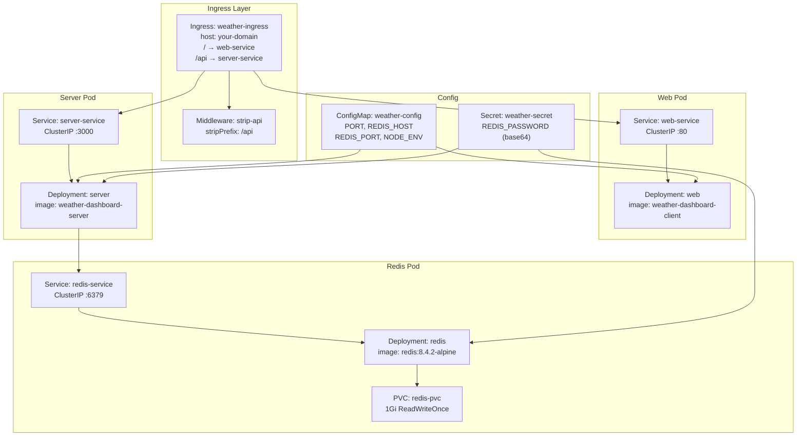
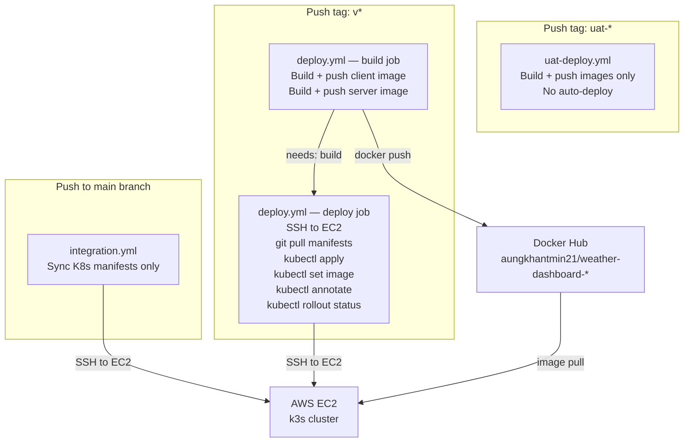
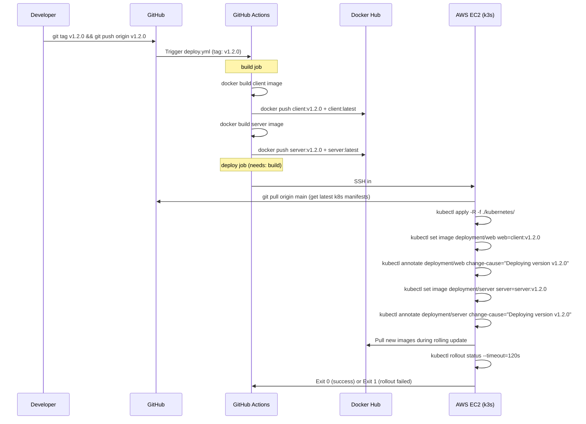

# Weather Dashboard

A full-stack weather dashboard that fetches real-time data from the [Open-Meteo API](https://open-meteo.com/) with Redis caching, containerized with Docker, and deployed on Kubernetes (k3s on AWS EC2) using a GitOps-style CI/CD pipeline via GitHub Actions.

---

## Table of Contents

- [Project Overview](#project-overview)
- [System Architecture](#system-architecture)
- [GitOps Workflow](#gitops-workflow)
- [Repository Structure](#repository-structure)
- [Local Development](#local-development)
- [Configuration Reference](#configuration-reference)
- [Deployment](#deployment)
- [Rollout & Rollback Procedures](#rollout--rollback-procedures)

---

## Project Overview

| Layer | Technology |
|---|---|
| Frontend | React 19 + Vite, served via Nginx (multi-stage Docker build) |
| Backend | Node.js 18 + Express |
| Cache | Redis 8.4.2-alpine, 30-minute TTL, persistent storage via PVC |
| External API | Open-Meteo (free, no API key required) |
| Container Registry | Docker Hub (`aungkhantmin21/weather-dashboard-client`, `aungkhantmin21/weather-dashboard-server`) |
| Orchestration | Kubernetes (k3s on AWS EC2) |
| Ingress | Traefik (built into k3s) with strip-prefix middleware |
| CI/CD | GitHub Actions (3 pipelines) |

---

## System Architecture

### High-Level Architecture



### Request Flow



> **The strip-api middleware** is a Traefik `Middleware` resource (`strip-api-middleware.yml`) that removes the `/api` prefix before forwarding requests to the backend. This means the frontend calls `/api/weather/yangon` but the Express server receives `/weather/yangon` — keeping the backend routes clean and prefix-unaware.

### Kubernetes Resource Architecture



---

## GitOps Workflow

The cluster never receives code directly. GitHub is the single source of truth. Kubernetes manifests live in the repo and are applied to the cluster via SSH from GitHub Actions runners — no engineer's laptop is involved in production deployments.

### Pipeline Overview



### Production Deployment Sequence



### Integration Pipeline (manifest-only sync)

Triggered on every push to `main`. Does **not** rebuild images — only syncs Kubernetes manifest changes to the cluster. Use this when you change configmaps, ingress rules, resource limits, or any other K8s config without a code change.

```
push to main → SSH to EC2 → git pull → kubectl apply -R -f ./kubernetes/
```

### UAT Pipeline

Triggered by tags matching `uat-*` (e.g. `uat-2.0.0`). Builds and pushes versioned images to Docker Hub but does **not** deploy automatically. This lets QA test the image before it goes to production.

```
git tag uat-2.0.0 → build images → push uat-2.0.0 tag to Docker Hub → stop (no deploy)
```

---

## Repository Structure

```
weather-dashboard/
│
├── .github/
│   └── workflows/
│       ├── deploy.yml          # Production: build + push + deploy (triggered by v* tags)
│       ├── integration.yml     # Manifest sync only (triggered by push to main)
│       └── uat-deploy.yml      # UAT: build + push only (triggered by uat-* tags)
│
├── kubernetes/
│   ├── configmap.yml           # Non-sensitive env vars (PORT, REDIS_HOST, etc.)
│   ├── ingress.yml             # Traefik Ingress with path routing rules
│   ├── redis-deployment.yml    # Redis Deployment + ClusterIP Service
│   ├── redis-pvc.yml           # PersistentVolumeClaim for Redis data (1Gi)
│   ├── secret.yml              # Base64-encoded REDIS_PASSWORD
│   ├── server-deployment.yml   # Backend Deployment + ClusterIP Service
│   ├── strip-api-middleware.yml # Traefik Middleware to strip /api prefix
│   └── web-deployment.yml      # Frontend Deployment + ClusterIP Service
│
├── server/
│   ├── config/
│   │   └── redis.js            # Redis client setup with auth
│   ├── routes/
│   │   ├── index.js            # Route aggregator
│   │   └── weather.js          # /weather/:city, /cities, DELETE /weather/cache/:city
│   ├── services/
│   │   └── weatherService.js   # Open-Meteo API calls, Redis cache logic, city coordinates
│   ├── server.js               # Express app entry point, SIGTERM handler
│   ├── Dockerfile              # Node.js 18 production image
│   └── .env.example            # Environment variable template
│
├── web/
│   ├── src/
│   │   ├── App.jsx             # Main app, city selection, API calls
│   │   └── components/
│   │       └── WeatherCard.jsx # Weather display component
│   ├── Dockerfile              # Multi-stage: Vite build → Nginx serve
│   ├── Dockerfile.dev          # Dev image with hot reload
│   └── entrypoint.sh           # Runtime env injection for VITE_API_URL
│
└── docker-compose.yml          # Local dev: web + server + redis
```

---

## Local Development

### Option 1 — Docker Compose (recommended for quick start)

```bash
# Clone the repo
git clone https://github.com/AungKhantMin21/weather-dashboard.git
cd weather-dashboard

# Start all three services
docker compose up -d

# Check logs
docker compose logs -f server

# Stop
docker compose down
```

Services will be available at:
- Frontend: http://localhost:80
- Backend API: http://localhost:3000
- Redis: localhost:6379

### Option 2 — Kubernetes (minikube)

```bash
# Start minikube and enable ingress
minikube start
minikube addons enable ingress

# Create the Redis password secret
kubectl create secret generic weather-secret \
  --from-literal=REDIS_PASSWORD=your-local-password

# Apply all manifests
kubectl apply -R -f ./kubernetes/

# Watch pods come up
kubectl get pods -w

# Get the minikube IP and add to /etc/hosts
echo "$(minikube ip) weather.local" | sudo tee -a /etc/hosts

# Access at http://weather.local
```

---

## Configuration Reference

| Variable | Source | Description |
|---|---|---|
| `PORT` | ConfigMap: `weather-config` | Express server port (default: 3000) |
| `REDIS_HOST` | ConfigMap: `weather-config` | Redis service hostname (`redis-service`) |
| `REDIS_PORT` | ConfigMap: `weather-config` | Redis port (default: 6379) |
| `NODE_ENV` | ConfigMap: `weather-config` | Runtime environment |
| `REDIS_PASSWORD` | Secret: `weather-secret` | Redis auth password (base64 encoded in manifest) |
| `VITE_API_URL` | Deployment env / entrypoint.sh | API base URL seen by the React frontend |

### API Endpoints

| Method | Path | Description |
|---|---|---|
| `GET` | `/health` | Health check — returns `{ status: "OK", timestamp }` |
| `GET` | `/weather/cities` | List all supported cities with coordinates |
| `GET` | `/weather/:city` | Fetch weather for a city (checks Redis cache first) |
| `DELETE` | `/weather/cache/:city` | Invalidate the Redis cache entry for a specific city |

> Via Ingress, all backend routes are prefixed with `/api`. For example, `/api/weather/yangon` → Traefik strips `/api` → Express receives `/weather/yangon`.

### Supported Cities

Yangon, Mandalay, Naypyitaw, Bangkok, Singapore, Tokyo, London, New York

---

## Deployment

### Prerequisites

- AWS EC2 instance (Ubuntu 22.04, t3.micro or larger)
- k3s installed on the EC2 instance
- Docker Hub account
- GitHub repository secrets configured

### GitHub Secrets Required

| Secret | Description |
|---|---|
| `DOCKER_USERNAME` | Docker Hub username |
| `DOCKER_PASSWORD` | Docker Hub access token |
| `EC2_HOST` | EC2 public IP or Elastic IP |
| `EC2_USERNAME` | SSH username (`ubuntu`) |
| `EC2_SSH_KEY` | Contents of your EC2 `.pem` private key |

### First-Time EC2 Setup

```bash
# SSH into EC2
ssh -i ~/.ssh/your-key.pem ubuntu@<EC2_IP>

# Install k3s
curl -sfL https://get.k3s.io | sh -

# Configure kubectl for ubuntu user
mkdir -p ~/.kube
sudo cp /etc/rancher/k3s/k3s.yaml ~/.kube/config
sudo chown ubuntu:ubuntu ~/.kube/config
echo 'export KUBECONFIG=~/.kube/config' >> ~/.bashrc
source ~/.bashrc

# Clone the repo onto the server
git clone https://github.com/AungKhantMin21/weather-dashboard.git
cd weather-dashboard

# Create the Redis password secret (do this before applying manifests)
kubectl create secret generic weather-secret \
  --from-literal=REDIS_PASSWORD=your-strong-password-here

# Apply all manifests
kubectl apply -R -f ./kubernetes/

# Verify everything is running
kubectl get pods
kubectl get ingress
```

### Ingress Configuration

Your `kubernetes/ingress.yml` host field should match your domain or IP:

```yaml
spec:
  ingressClassName: traefik
  rules:
    - host: your-domain.com          # real domain, OR
    # - host: 54.123.45.67.nip.io   # free option using Elastic IP + nip.io
```

The `strip-api` middleware is applied via annotation and removes the `/api` prefix before forwarding to the backend service. It is defined in `strip-api-middleware.yml` as a Traefik `Middleware` CRD.

### Open Firewall Ports (AWS Security Group)

| Port | Protocol | Source | Purpose |
|---|---|---|---|
| 22 | TCP | Your IP | SSH |
| 80 | TCP | 0.0.0.0/0 | HTTP |
| 443 | TCP | 0.0.0.0/0 | HTTPS |
| 6443 | TCP | Your IP | kubectl API |

---

## Rollout & Rollback Procedures

### Viewing Rollout History

After each deployment, the pipeline annotates deployments with the version tag. You can inspect the full history:

```bash
kubectl rollout history deployment/web
kubectl rollout history deployment/server
```

Example output:
```
REVISION  CHANGE-CAUSE
1         Deploying version v1.0.0
2         Deploying version v1.0.1
3         Deploying version v1.1.0
```

### Watching a Live Rollout

```bash
# Watch pods cycle during a rolling update
kubectl get pods -w

# Check rollout progress explicitly
kubectl rollout status deployment/web
kubectl rollout status deployment/server
```

### Rolling Back to the Previous Version

If a deployment causes issues, roll back to the last known good state in one command:

```bash
kubectl rollout undo deployment/web
kubectl rollout undo deployment/server
```

Verify the rollback completed:

```bash
kubectl rollout status deployment/web
kubectl rollout history deployment/web
```

### Rolling Back to a Specific Version Tag

If you need to go back to a specific release (e.g. `v1.0.1`) rather than just the previous revision:

```bash
# Set the image directly to the known good tag
kubectl set image deployment/web \
  web=aungkhantmin21/weather-dashboard-client:v1.0.1

kubectl set image deployment/server \
  server=aungkhantmin21/weather-dashboard-server:v1.0.1

# Annotate so history stays meaningful
kubectl annotate deployment/web \
  kubernetes.io/change-cause="Rollback to v1.0.1" --overwrite

kubectl annotate deployment/server \
  kubernetes.io/change-cause="Rollback to v1.0.1" --overwrite

# Confirm pods are healthy
kubectl rollout status deployment/web --timeout=60s
kubectl rollout status deployment/server --timeout=60s
```

### Rollback via Revision Number

If you know the exact revision number from `rollout history`:

```bash
# Roll back to revision 2
kubectl rollout undo deployment/web --to-revision=2
kubectl rollout undo deployment/server --to-revision=2
```

### Emergency: What to Do When the New Version is Broken

1. **Identify the problem fast**
   ```bash
   kubectl get pods                        # are pods crashing?
   kubectl logs deployment/server          # what is the app saying?
   kubectl describe deployment/server      # any image pull or probe failures?
   ```

2. **Immediate rollback** (restores previous image in ~30 seconds)
   ```bash
   kubectl rollout undo deployment/web
   kubectl rollout undo deployment/server
   ```

3. **Confirm recovery**
   ```bash
   kubectl rollout status deployment/web
   kubectl get pods
   ```

4. **Verify the app is healthy** — visit your domain or hit the health endpoint:
   ```bash
   curl http://your-domain.com/api/health
   # Expected: {"status":"OK","timestamp":"..."}
   ```

5. **Fix the issue** — patch the code, push a new tag, let the pipeline deploy the fix as a new version.

### Scaling

```bash
# Scale up for higher traffic
kubectl scale deployment/web --replicas=3
kubectl scale deployment/server --replicas=3

# Scale back down
kubectl scale deployment/web --replicas=1
kubectl scale deployment/server --replicas=1
```

> Redis should remain at 1 replica since it uses a `ReadWriteOnce` PVC. Running multiple Redis replicas requires a different storage setup.

### Cache Management

To force-refresh weather data for a specific city without restarting pods:

```bash
# Via the API (through Ingress)
curl -X DELETE http://your-domain.com/api/weather/cache/yangon

# Or directly on the server pod
kubectl exec deployment/server -- \
  curl -X DELETE http://localhost:3000/weather/cache/yangon
```